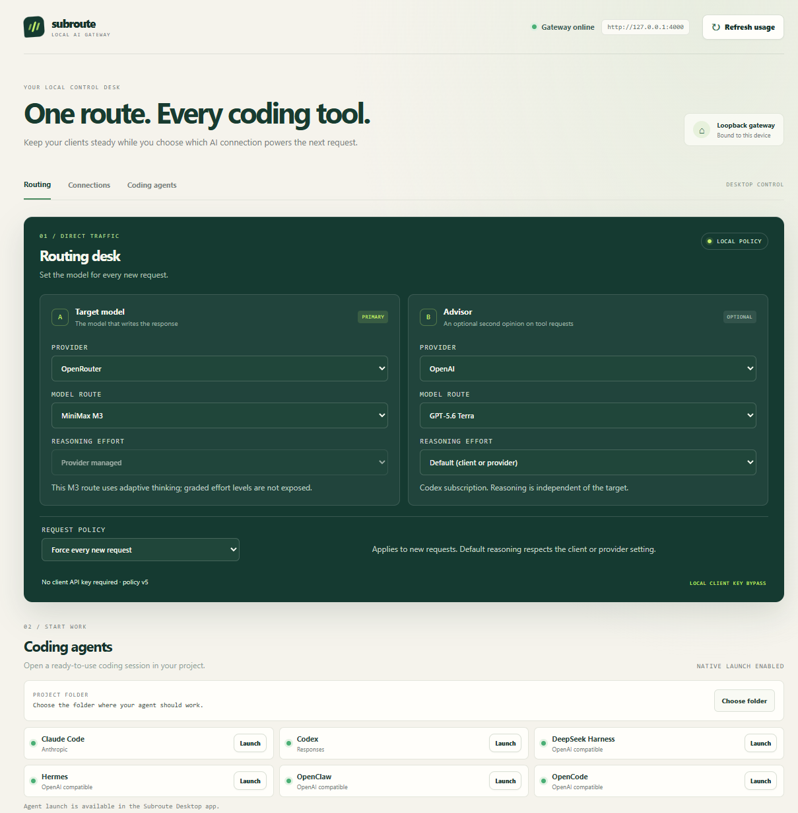

<div align="center">
  <h1>Subroute</h1>
  <h3>Keep your coding tools steady. Choose your AI route in one place.</h3>
  <p>A local AI gateway and desktop control desk for developers who work across AI subscriptions, API providers, and local models.</p>
  <p><a href="#english">English</a> · <a href="#简体中文">简体中文</a></p>
</div>

<p align="center">
  <a href="artifacts/subroute-electron.png"></a>
</p>
<p align="center"><sub>Electron desktop · model routing and agent launch / Electron 桌面端 · 模型路由与 Agent 启动</sub></p>

<a id="english"></a>

## The problem

Your coding tools remember an endpoint and model. Your AI provider, account, or preferred route can change. Updating every client each time is tedious and makes it harder to know which connection will handle the next request.

**Subroute gives compatible clients one local endpoint. Set the model to `current`, then choose the route centrally.**

## What you get

| | Value in your workflow |
| --- | --- |
| **One steady endpoint** | Keep compatible coding clients pointed at `http://127.0.0.1:4000/v1` while you change the selected route. |
| **A route you can see and change** | Choose a configured provider and model from the shared browser or desktop control desk. |
| **Clear connection status** | See which sources are configured, need setup, or report usage. Missing quota data stays unavailable instead of being guessed. |
| **Local-first control** | Run the gateway on your machine with Docker Compose. Electron adds a native shell and optional coding-agent launch helpers. |

## How it works

```text
Your coding tools
       │  OpenAI-compatible API · model: current
       ▼
Subroute on 127.0.0.1:4000
       │  saved local routing policy
       ▼
Configured subscription · API provider · local model
```

LiteLLM handles the public API protocols, streaming, and standard provider adapters. Subroute adds the local routing policy, configured subscription integrations, provider status, and control desk. Electron uses the same control desk as `/control`; it does not run the gateway.

## Get started

Make credentials available as environment variables for the providers you plan to use, then start the production gateway from the repository root:

```powershell
docker compose up -d gateway
```

Open the control desk at [http://127.0.0.1:4000/control](http://127.0.0.1:4000/control), choose a configured route, then point a compatible coding tool to:

```text
Base URL: http://127.0.0.1:4000/v1
Model:    current
```

You can select a specific model alias in a client when you want that client to keep a fixed route. The available choices come from this checkout's [`config/litellm.yaml`](config/litellm.yaml).

### Use the Electron app

With the gateway running, launch the desktop control desk:

```powershell
cd desktop
npm install
npm start
```

On first launch, connect it to a responding loopback Subroute gateway. Desktop stores the gateway address locally, not provider API keys. Its optional agent launcher starts supported coding CLIs with session-only Subroute settings. See [desktop/README.md](desktop/README.md).

### Keep production and staging separate

Compose exposes production on `127.0.0.1:4000` and staging on `127.0.0.1:4005`. Staging has its own database and routing policy, while model/provider configuration is shared:

```powershell
docker compose up -d gateway-staging
```

## Routing, without surprises

- **`alias`** is the default. It resolves `current`, `default`, and `auto` using the saved route.
- **`force`** applies the selected route to every new inference request.
- **`off`** leaves model dispatch to LiteLLM.
- **Advisor** is selected independently. It enables consultation on the Anthropic Messages API; `No advisor` disables it.

Subroute does not configure gateway retries or fallback routes. If the selected provider fails, the request fails visibly rather than silently switching to another connection.

## Know the limits

A stable endpoint does not make providers interchangeable. Tool use, streaming, vision, context size, reasoning options, and subscription access depend on each route. The Antigravity Gemini subscription integration is text-only and is not certified for streaming or tool use. Check the capabilities of the route you select.

The gateway binds to loopback by default. Keep it on your machine unless you intentionally configure and secure a different network boundary.

## Project notes

- [Architecture and ownership](docs/misc/architecture.md)
- [Product direction](docs/northstar/README.md)
- [Gateway configuration](config/litellm.yaml)
- [Desktop app details](desktop/README.md)

---

<a id="简体中文"></a>

## 简体中文

<div align="center">
  <h2>让编码工具保持不变，在一个地方切换 AI 路由。</h2>
  <p>Subroute 是面向开发者的本地 AI 网关与桌面控制台，支持将已配置的 AI 订阅、API 服务和本地模型接入同一套编码工作流。</p>
</div>

### 要解决的问题

编码工具会记住 API 地址和模型，而你使用的 AI 服务、账号或首选模型可能会变化。每次切换都要逐个修改客户端，既麻烦，也不容易确认下一次请求会发给哪个服务。

**Subroute 为兼容的客户端提供一个本地固定入口。客户端设置一次 `current`，之后在 Subroute 控制台集中选择路由。**

### 它能带来什么

| | 工作中的实际价值 |
| --- | --- |
| **一个稳定入口** | 兼容的编码工具始终连接 `http://127.0.0.1:4000/v1`，切换服务时无需逐个修改客户端。 |
| **路由清晰可控** | 在浏览器或桌面控制台中，选择已经配置好的服务和模型。 |
| **连接状态可见** | 查看哪些服务已配置、需要设置，或能提供用量数据。服务未提供的额度不会被猜测或伪装成可用。 |
| **本地优先** | 使用 Docker Compose 在本机运行网关。Electron 桌面端提供原生界面和可选的编码 Agent 启动功能。 |

### 工作方式

```text
你的编码工具
       │  OpenAI 兼容 API · 模型：current
       ▼
Subroute（127.0.0.1:4000）
       │  本地保存的路由策略
       ▼
已配置的订阅 · API 服务 · 本地模型
```

LiteLLM 负责公开 API 协议、流式传输和标准服务适配。Subroute 负责本地路由策略、已配置的订阅集成、服务状态和控制台。Electron 与网页 `/control` 使用同一套控制界面；网关本身由独立的 Compose 服务运行。

### 快速开始

先为要使用的服务准备环境变量凭据，再在仓库根目录启动生产网关：

```powershell
docker compose up -d gateway
```

打开[路由控制台](http://127.0.0.1:4000/control)，选择已经配置好的路由，再将兼容的编码工具指向：

```text
API 地址： http://127.0.0.1:4000/v1
模型：     current
```

如果希望某个客户端始终使用固定模型，也可以直接选择具体模型别名。当前可选项见本仓库的 [`config/litellm.yaml`](config/litellm.yaml)。

### 使用 Electron 桌面端

先启动网关，再运行桌面控制台：

```powershell
cd desktop
npm install
npm start
```

首次启动时，将桌面端连接到有响应的本地 Subroute 网关。桌面端只在本地保存网关地址，不保存服务 API 密钥。可选的 Agent 启动器会使用仅对本次会话生效的 Subroute 配置来启动受支持的编码 CLI。详见 [desktop/README.md](desktop/README.md)。

### 隔离生产与预发布环境

Compose 将生产环境绑定到 `127.0.0.1:4000`，预发布环境绑定到 `127.0.0.1:4005`。两者使用独立的数据库和路由策略，但共享模型与服务配置：

```powershell
docker compose up -d gateway-staging
```

### 路由行为

- **`alias`** 是默认模式，根据已保存的路由解析 `current`、`default` 和 `auto`。
- **`force`** 将所选路由应用到之后的所有推理请求。
- **`off`** 将模型分发交由 LiteLLM 处理。
- **Advisor（顾问模型）** 独立选择。选择顾问后，Anthropic Messages API 请求会启用咨询；选择 `No advisor` 则关闭。

Subroute 不配置网关级重试或备用路由。所选服务失败时，请求会明确报错，不会悄悄改发给其他服务。

### 使用边界

统一入口不代表各服务能力相同。工具调用、流式传输、图像输入、上下文长度、推理选项和订阅访问能力都取决于具体路由。Antigravity Gemini 订阅集成目前仅支持文本，尚未认证流式传输或工具调用。请根据实际选择的路由确认其能力。

网关默认只监听本机回环地址。除非你主动配置并保护其他网络边界，否则请将其保留在本机使用。

### 项目文档

- [架构与职责边界](docs/misc/architecture.md)
- [产品方向](docs/northstar/README.md)
- [网关配置](config/litellm.yaml)
- [桌面端说明](desktop/README.md)
