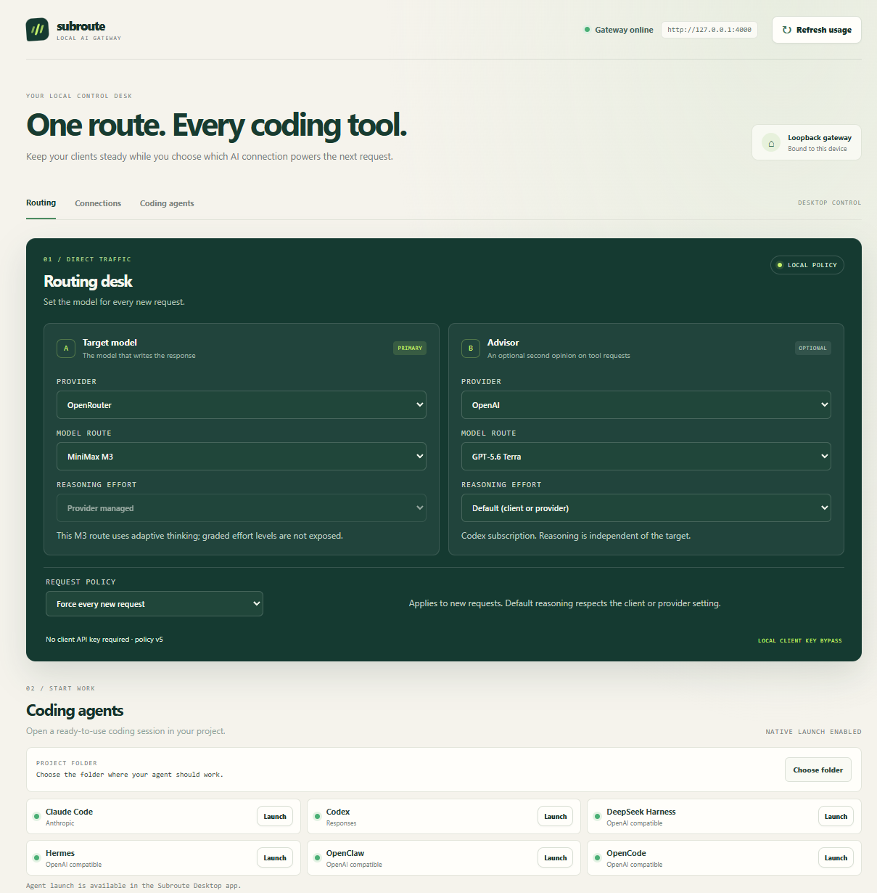

<div align="center">
  <h1>Subroute</h1>
  <h3>Keep your coding tools steady. Choose your AI route in one place.</h3>
  <p>A local AI gateway and desktop control desk for developers who work across AI subscriptions, API providers, and local models.</p>
  <p><a href="#english">English</a> · <a href="#简体中文">简体中文</a></p>
</div>

<p align="center">
  <a href="artifacts/subroute-electron.png"></a>
</p>
<p align="center"><sub>Electron desktop · model routing and agent launch / Electron 桌面端 · 模型路由与 Agent 启动</sub></p>

<a id="english"></a>


## Codex Advisor skill

The former **Luna Advisor Escalation** skill has moved to the central [Northstar package](https://github.com/stancsz/northstar/tree/main/skills) and is now called **Codex Advisor**. Install the four-skill Northstar package for `northstar`, `codex-qa`, `codex-subagents` and `codex-advisor`. See the [installation guide](https://github.com/stancsz/northstar/blob/main/docs/misc/install.md) and [Codex Advisor instructions](https://github.com/stancsz/northstar/blob/main/skills/codex-advisor/SKILL.md).

Subroute still owns the `experts` service, provider authentication and gateway runtime. Moving the skill does not move or deploy those services. Historical advisor evaluations below describe the Subroute revisions at which they were recorded.

The dedicated `experts` endpoint exposes GPT-6 Luna, GPT-6 Sol, GPT-6 Astra and GPT-6.1 Sol through their Advisor aliases, and accepts user images for screenshot-backed advice. Luna defaults to high reasoning effort; callers can select another configured model or effort. There is no retry or model fallback. Northstar's caller proactively attaches images with repeatable `--image` arguments; optional Advisor-directed Pi source reading remains caller orchestration, not backend tool execution. See [image-input verification and limits](docs/evals/advisor-image-input-2026-09-30.md).

## The problem

Your coding tools remember an endpoint and model. Your AI provider, account, or preferred route can change. Updating every client each time is tedious and makes it harder to know which connection will handle the next request.

**Subroute gives compatible clients one local endpoint. Set the model to `auto` for prioritized automatic routing, or `current` to use the route selected centrally.**

## What you get

| | Value in your workflow |
| --- | --- |
| **One steady endpoint** | Keep compatible coding clients pointed at `http://127.0.0.1:4000/v1` while you change the selected route. |
| **A route you can see and change** | Choose a configured provider and model from the shared browser or desktop control desk. |
| **Clear connection status** | See which sources are configured, need setup, or report usage. Missing quota data stays unavailable instead of being guessed. |
| **Local-first control** | Run the gateway on your machine with Docker Compose. Electron adds a native shell and optional coding-agent launch helpers. |

## How it works

```text
Your coding tools
       │  OpenAI-compatible API · model: auto
       ▼
Subroute on 127.0.0.1:4000
       │  MiniMax M3 → Gemini 3.8 Flash → Codex Luna
       ▼
First provider to complete the request
```

LiteLLM handles the public API protocols, streaming, and standard provider adapters. Subroute adds the local routing policy, configured subscription integrations, provider status, and control desk. Electron uses the same control desk as `/control`; it does not run the gateway.

## Get started

Make credentials available as environment variables for the providers you plan to use, then start the production gateway from the repository root:

```powershell
docker compose up -d gateway
```

Open the control desk at [http://127.0.0.1:4000/control](http://127.0.0.1:4000/control), choose a configured route, then point a compatible coding tool to:

```text
Base URL: http://127.0.0.1:4000/v1
Model:    auto
```

`auto` tries MiniMax M3 first, then Gemini 3.8 Flash through the subscription integration, then Codex Luna through the subscription integration if the preceding provider returns an error. This is request-time fallback, so a failed upstream attempt may still incur provider cost. Use `current` to follow the route selected in the control desk, or select a specific model alias to keep a fixed route. Available models are listed in this checkout's [`config/litellm.yaml`](config/litellm.yaml).

### Use the Electron app

With the gateway running, launch the desktop control desk:

```powershell
cd desktop
npm install
npm start
```

On first launch, connect it to a responding loopback Subroute gateway. Desktop stores the gateway address locally, not provider API keys. Its optional agent launcher starts supported coding CLIs with session-only Subroute settings. See [desktop/README.md](desktop/README.md).

### Keep production and staging separate

Compose exposes production on `127.0.0.1:4000` and staging on `127.0.0.1:4005`. Staging has its own database and routing policy, while model/provider configuration is shared:

```powershell
docker compose up -d gateway-staging
```

## Routing, without surprises

The production desk is set to **OpenRouter MiniMax M3**, **GPT-6 Luna Advisor**, and **high Advisor reasoning effort**. All OpenAI Advisor routes use GPT-6 or newer: Luna, Sol, Astra and GPT-6.1 Sol. These are selectable models, not a model lock. New routing state defaults to OpenRouter and Luna/high. `ACTIVE_MODEL` and `ADVISOR_MODEL` override initialization; persisted state takes precedence on subsequent starts, including explicitly disabled advisors and saved effort. Production retains its saved `force` mode; staging retains its own policy.

- **`alias`** is the default. It resolves `current` and `default` using the saved route. `auto` always uses the prioritized provider chain.
- **`force`** applies the selected route to known model requests except explicit `auto` requests and image generation.
- **`off`** leaves model dispatch to LiteLLM.
- **Advisor** is selected independently. It enables consultation on the Anthropic Messages API; GPT-6 Luna is available alongside the other configured advisors. `No advisor` disables it.

Subroute configures no automatic retries. Only requests explicitly using `auto` fall back across providers, in the documented order. Requests using `current` or a specific model fail visibly if that route fails.

### Generate an image

Clear image-generation intent in Chat Completions, Responses, or Anthropic Messages routes to **GPT-6 Luna through the Codex subscription** and exposes its hosted `image_generation` tool. The Images generation endpoint follows the same rule. This takes precedence over `force`, `alias`, `off`, and the request's model (including `auto`). It does not change the saved text/advisor policy and never falls back to another provider or consults the saved advisor.

For example, send `{"model":"current","messages":[{"role":"user","content":"Generate an image of a blue robot"}]}` to `/v1/chat/completions`. The latest user turn is checked for direct English/Chinese requests such as “generate an image”, “create a logo”, “draw a cat”, or “帮我生成一张图片”. Code, quoted examples, prior turns, image analysis, and explanatory questions do not trigger it. This is a conservative local pattern matcher, not a paid semantic classifier. For unrecognized wording, explicitly supply `tools: [{"type":"image_generation"}]` in Chat/Responses. Selecting an image tool through `tool_choice` also triggers the exception; the exact function names `image_generation`, `generate_image`, and `create_image` are translated to the hosted tool. Merely listing one of those custom functions does not reroute an unrelated request.

With direct intent and no caller tool choice, the image tool is selected. Explicit `auto` permits Luna to decide whether to generate or request another tool first; `none` conflicting with image intent is rejected. Conversation history, instructions, and other function tools are preserved through LiteLLM's translations. Returned function calls remain the client's responsibility.

Chat returns generated images in `choices[0].message.images` (or `delta.images` for SSE) as data URLs. Responses returns `image_generation_call.result` as base64 in its output, including the final SSE snapshot. Messages carries a Markdown image data URL in a text block, whose rendering depends on the client. Buffered and SSE conversation requests both wait for complete generation before returning image content. Captions are retained. The shared limit is one image per response, two concurrent image requests per gateway process, and 180 seconds; usage reports Luna tokens, not total image-model usage or cost.

For an Images API response, use `POST /v1/images/generations`:

```json
{
  "model": "codex-luna",
  "prompt": "A small blue circle on a white background",
  "n": 1,
  "size": "auto",
  "quality": "low",
  "response_format": "b64_json"
}
```

Decode `data[0].b64_json` to obtain the image. This endpoint returns a complete image, with at most two concurrent image requests per gateway process and a 180-second deadline. It rejects multiple images, URL responses, streaming, and legacy `style`/`user` parameters. Use `size: "auto"` or omit it: the subscription tool does not honor exact pixel dimensions, so fixed sizes are rejected before dispatch. For PNG outputs, `size` reports the dimensions read from the actual image bytes. Provider options are forwarded to the tool; provider support may vary. `luna_usage` is the reported Responses usage, and `image_usage` is unavailable unless supplied separately by the provider; neither is an estimate of total image-generation cost.

The gateway does not implement the Images edit/variation endpoints. Fixed dimensions are also rejected for explicit hosted image tools. See the [intent-routing verification](docs/evals/luna-image-intent-2026-09-29.md) for protocol evidence and the narrow LiteLLM compatibility workarounds.

## Know the limits

A stable endpoint does not make providers interchangeable. Tool use, streaming, vision, context size, reasoning options, and subscription access depend on each route. The Antigravity Gemini subscription integration supports text, PCM WAV/MP3 audio input and schema-constrained tool calls (audio and client tools cannot be combined). The sidecar sends prompts through the CLI's NDJSON stdin protocol, so long prompts do not consume OS command-line argument space. The client executes returned tool calls; the subscription sidecar does not execute them. In tool mode, bounded plain-text commentary AGY appends after its schema result is ignored, while additional structured results are rejected. It does not support vision. Stream requests are returned as SSE after the CLI has completed the response, so tokens are not progressively streamed.

The Codex subscription endpoint rejects client output-token caps. Subroute omits `max_tokens` and `max_output_tokens` on that provider route, so the Codex backend chooses its own output limit. Gemini Subscription also uses backend-managed output limits: its CLI exposes no output-token cap, so client caps are not enforced. This applies to buffered and SSE responses, including Anthropic Messages. Subroute preserves the completed response and actual provider usage rather than truncating output to imply that a cap was honored. Tool schemas must be self-contained; remote schema references are rejected before provider dispatch.

The gateway binds to loopback by default. Keep it on your machine unless you intentionally configure and secure a different network boundary.

Audio requests use Chat `input_audio`, route explicitly to Gemini Subscription and disable the saved advisor for that request, including in Force mode. The saved policy stays intact. At most two files and 20 MiB combined are accepted. Messages/Responses audio is rejected rather than dropped. The read-only [music MCP](docs/misc/music-listening-mcp.md) sends original audio to Google through this route; it does not perform DSP or certify mixing quality.

MCP refusals and transport failures return structured `isError` results, never successful listening reports. An explicit audio filter refusal may be retried by LiteLLM up to twice with the same question and files; persistent refusal remains visible, with no word deletion or model fallback. MCP reports the retry count; recovered responses label usage as final-attempt-only, while earlier failed-attempt usage remains in gateway/sidecar logs. The fixed 60-task sample reached at least 58/60 under this bound, which is not a guarantee for future traffic. See [filter candidates and evidence](docs/misc/gemini-content-filter-candidates.md); there is no verified complete keyword blacklist or zero-error guarantee.

The optional music client pins Mutagen 1.47.0 to inspect MP3 stream metadata from the uploaded byte snapshot; header-derived durations are labelled estimates. Verified refusal usage is preserved when available. These checks do not certify full decoding or perceptual accuracy.

## Project notes

- [Architecture and ownership](docs/misc/architecture.md)
- [Gemini music-listening MCP: two working tools and remaining mixing limits](docs/misc/music-listening-mcp.md)
- [Product direction](docs/northstar/README.md)
- [Gateway configuration](config/litellm.yaml)
- [Desktop app details](desktop/README.md)

---

<a id="简体中文"></a>

## 简体中文

<div align="center">
  <h2>让编码工具保持不变，在一个地方切换 AI 路由。</h2>
  <p>Subroute 是面向开发者的本地 AI 网关与桌面控制台，支持将已配置的 AI 订阅、API 服务和本地模型接入同一套编码工作流。</p>
</div>

### 要解决的问题

编码工具会记住 API 地址和模型，而你使用的 AI 服务、账号或首选模型可能会变化。每次切换都要逐个修改客户端，既麻烦，也不容易确认下一次请求会发给哪个服务。

**Subroute 为兼容的客户端提供一个本地固定入口。使用 `auto` 按优先级自动路由，或使用 `current` 跟随控制台中选择的路由。**

### 它能带来什么

| | 工作中的实际价值 |
| --- | --- |
| **一个稳定入口** | 兼容的编码工具始终连接 `http://127.0.0.1:4000/v1`，切换服务时无需逐个修改客户端。 |
| **路由清晰可控** | 在浏览器或桌面控制台中，选择已经配置好的服务和模型。 |
| **连接状态可见** | 查看哪些服务已配置、需要设置，或能提供用量数据。服务未提供的额度不会被猜测或伪装成可用。 |
| **本地优先** | 使用 Docker Compose 在本机运行网关。Electron 桌面端提供原生界面和可选的编码 Agent 启动功能。 |

### 工作方式

```text
你的编码工具
       │  OpenAI 兼容 API · 模型：auto
       ▼
Subroute（127.0.0.1:4000）
       │  MiniMax M3 → Gemini 3.8 Flash → Codex Luna
       ▼
第一个成功完成请求的服务
```

LiteLLM 负责公开 API 协议、流式传输和标准服务适配。Subroute 负责本地路由策略、已配置的订阅集成、服务状态和控制台。Electron 与网页 `/control` 使用同一套控制界面；网关本身由独立的 Compose 服务运行。

### 快速开始

先为要使用的服务准备环境变量凭据，再在仓库根目录启动生产网关：

```powershell
docker compose up -d gateway
```

打开[路由控制台](http://127.0.0.1:4000/control)，选择已经配置好的路由，再将兼容的编码工具指向：

```text
API 地址： http://127.0.0.1:4000/v1
模型：     auto
```

`auto` 首先尝试 MiniMax M3；若服务返回错误，则依次尝试 Gemini 3.8 Flash 订阅和 Codex Luna 订阅。失败的上游尝试仍可能产生费用。使用 `current` 跟随控制台选择的路由，或选择具体模型别名以固定路由。当前模型见本仓库的 [`config/litellm.yaml`](config/litellm.yaml)。

### 使用 Electron 桌面端

先启动网关，再运行桌面控制台：

```powershell
cd desktop
npm install
npm start
```

首次启动时，将桌面端连接到有响应的本地 Subroute 网关。桌面端只在本地保存网关地址，不保存服务 API 密钥。可选的 Agent 启动器会使用仅对本次会话生效的 Subroute 配置来启动受支持的编码 CLI。详见 [desktop/README.md](desktop/README.md)。

### 隔离生产与预发布环境

Compose 将生产环境绑定到 `127.0.0.1:4000`，预发布环境绑定到 `127.0.0.1:4005`。两者使用独立的数据库和路由策略，但共享模型与服务配置：

```powershell
docker compose up -d gateway-staging
```

### 路由行为

- **`alias`** 是默认模式，根据已保存的路由解析 `current` 和 `default`。`auto` 始终使用按优先级排列的服务链。
- **`force`** 将所选路由应用到已知模型的推理请求，显式使用 `auto` 和图片生成请求除外。
- **`off`** 将模型分发交由 LiteLLM 处理。
- **Advisor（顾问模型）** 独立选择。选择顾问后，Anthropic Messages API 请求会启用咨询；GPT-6 Luna 可与其他已配置顾问一样选择，选择 `No advisor` 则关闭。

Subroute 默认关闭通用自动重试。Gemini 音频请求仅在 Antigravity 明确返回 `provider_content_filter` 时由 LiteLLM 最多重试两次；普通 502、超时、文本请求和其他模型仍不重试。只有明确使用 `auto` 的请求才会按文档顺序尝试备用服务。MCP 会报告重试次数；恢复响应中的 usage 仅统计最后一次 provider 调用，早先失败调用的 usage 保留在 gateway/sidecar 日志。

### 使用边界

Chat、Responses 和 Messages 中明确的图片生成意图，以及 Images generation endpoint，均优先于 Force/alias/off 和 `auto`，使用 Codex Subscription GPT-6 Luna 的 `image_generation` 工具。只检查最新用户消息中的直接中英文请求，例如 “generate an image”“draw a cat”“帮我生成一张图片”；不扫描历史消息、代码、引用示例或图片分析。这是本地保守规则，不调用额外分类模型。Chat/Responses 可显式声明 hosted `image_generation` 工具；显式选择 `image_generation`、`generate_image`、`create_image` 函数也会转换到 hosted 工具。仅列出自定义函数不会改变无关请求的路由。此例外不修改已保存策略，也不调用顾问或 fallback。

Chat 通过 `message.images`/`delta.images` 返回图片 data URL；Responses 通过 `image_generation_call.result` 返回 base64；Messages 通过文本块中的 Markdown data URL 返回，能否显示取决于客户端。会保留上下文、说明文字和其他函数工具。会话接口支持完整响应和 SSE，但均等待生成完成后发送图片。Images endpoint 返回 `data[0].b64_json`，不支持流式或 URL 返回。共享限制为单张图片、每进程两个并发和 180 秒截止时间；请省略 `size` 或设为 `auto`，固定像素尺寸会被拒绝。Usage 仅为 Luna tokens，不代表完整图片费用。未实现 Images 编辑/变体端点。证据见 [图片意图路由验证](docs/evals/luna-image-intent-2026-09-29.md)。

统一入口不代表各服务能力相同。工具调用、流式传输、图像输入、上下文长度、推理选项和订阅访问能力都取决于具体路由。Antigravity Gemini 订阅集成支持文本、PCM WAV/MP3 音频输入和受 schema 约束的工具调用（音频和客户端工具不能合用）。Sidecar 通过 CLI 的 NDJSON stdin 协议传递 prompt，避免长 prompt 占用操作系统命令行参数空间。工具调用由客户端执行，订阅 sidecar 不会代为执行；工具模式下 AGY 在 schema 结果后追加的有限纯文本说明会被忽略，额外的结构化结果会被拒绝；该路由不支持图像。流式请求会在 CLI 完成响应后通过 SSE 返回，不会逐 token 输出。Codex 订阅端点不接受调用方的输出 token 上限，Subroute 会在该 provider 路由中省略 `max_tokens` 和 `max_output_tokens`，由 Codex 后端选择输出上限。请根据实际选择的路由确认其能力。

Gemini 订阅同样由后端管理输出上限：CLI 不提供输出 token 上限参数，因此不会执行调用方设置的上限。这适用于普通响应、SSE 和 Anthropic Messages。Subroute 保留完整响应和真实 provider usage，不通过截断输出伪装成遵守了上限。工具 schema 必须自包含；远程 schema 引用会在 provider 调用前被拒绝。

音频请求使用 Chat `input_audio`，明确路由到 Gemini Subscription，并关闭本次请求的 Advisor，Force 模式同样适用；保存的策略不变。最多两个附件，合计 20 MiB。Messages/Responses 音频会明确拒绝，防止静默丢失。[音乐 MCP](docs/misc/music-listening-mcp.md) 经此路径将原始音频发送到 Google，不执行 DSP 或认证混音质量。

MCP 的拒绝和传输失败会返回结构化 `isError`，不会伪造成功听觉报告。明确的音频过滤拒绝可由 LiteLLM 对同一问题和文件最多重试两次；持续拒绝仍可见，不改词、不删词、不切模型。MCP 报告重试次数和最后一次调用的 usage 范围。该策略在固定 60 项抽样中达到至少 58/60，但不保证未来成功率。见 [过滤候选语境与实测](docs/misc/gemini-content-filter-candidates.md)；没有已验证的完整禁词表或零错误保证。

可选 music client 固定 Mutagen 1.47.0，从待发送字节快照检查 MP3 流元数据，头部推导时长注明估计；拒绝时有有效 provider usage 就保留。这些检查不能认证完整解码或听觉判断准确。

网关默认只监听本机回环地址。除非你主动配置并保护其他网络边界，否则请将其保留在本机使用。

### 项目文档

- [架构与职责边界](docs/misc/architecture.md)
- [Gemini 音乐听觉 MCP：两个可用入口与混音验收边界](docs/misc/music-listening-mcp.md)
- [产品方向](docs/northstar/README.md)
- [网关配置](config/litellm.yaml)
- [桌面端说明](desktop/README.md)
