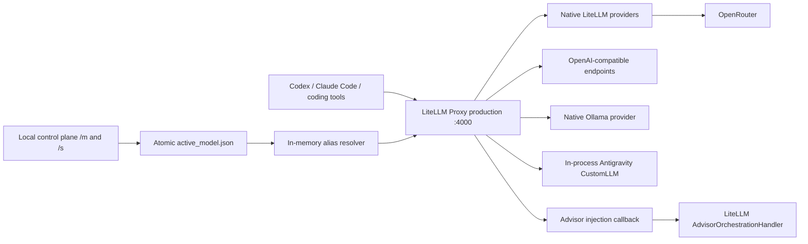

# Architecture

LiteLLM Proxy is the only public protocol engine. This repository does not
translate Chat Completions, Responses, Anthropic Messages, SSE events, tool
calls, or provider errors.

## Ownership

LiteLLM owns:

- HTTP endpoints used by coding tools
- streaming and tool-event protocol behavior
- standard provider authentication and transport
- model deployments and key selection

This repository owns:

- a small, reviewable LiteLLM configuration
- explicit public model aliases
- fail-closed retry and fallback settings
- acceptance tests that prevent protocol and provider abstractions from
  growing back into the project
- an opt-in callback that injects LiteLLM's built-in Advisor tool for exact
  guided aliases on the Anthropic Messages path
- a loopback-only routing control plane that resolves `current`, or explicitly
  applies `force` mode, before LiteLLM selects a deployment

The dynamic routing callback precedes the Advisor callback. A request for
`current` can therefore resolve to a guided alias and still receive Advisor
injection. Rewrites carry requested and resolved model names, routing mode, and
policy version as audit metadata. Existing in-flight requests are never
retargeted.

Provider-specific Python belongs here only when LiteLLM has no native provider
or OpenAI-compatible seam. Antigravity is the one current exception and runs
inside the proxy process. ChatGPT subscription uses LiteLLM's own Responses
bridge; a deployment hook refreshes local credentials immediately before each
request.

## Evidence boundary

Config tests prove only the intended ownership boundary. LiteLLM startup proves
only that the proxy can load. Coding-tool compatibility requires the real
LeanRouter protocol fixtures and live Codex and Claude Code tool/stream tests.
