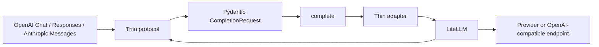

# unified-llm-gateway architecture

The version 0.1 kernel does only three things:

1. Validate a small subset of LiteLLM completion inputs.
2. Let an explicit adapter map endpoint, authentication, and model identity.
3. Return LiteLLM's standard `ModelResponse` unchanged.

LiteLLM handles provider calls. OpenAI-compatible local or subscription bridges
use LiteLLM's OpenAI-compatible provider. OpenAI subscription uses LiteLLM's
Responses-to-Chat bridge. The Gemini adapter invokes the authenticated local
Antigravity CLI and constructs the same LiteLLM `ModelResponse`, without an
HTTP sidecar. MiniMax multi-key balancing uses LiteLLM
Router deployments. The kernel does not select providers, retry, fall back,
normalize responses, expose an HTTP API, or implement streaming. New channels
belong in thin adapters or external sidecars.

The three protocol modules support non-streaming text only. Unsupported tools,
media, provider state, and streaming inputs fail closed rather than adding a
second full API implementation to the kernel.
