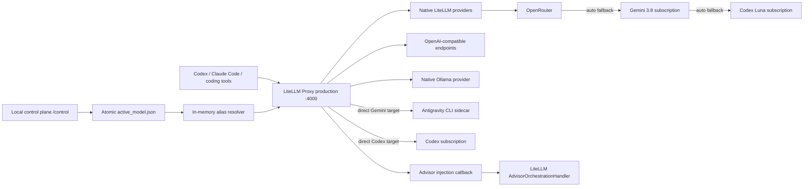

# Architecture

LiteLLM Proxy is the only public protocol engine. Standard provider translation
stays in LiteLLM. The narrow Codex advisor adapter collects upstream Responses
SSE into a completed text response and validates terminal status and usage.

## Ownership

LiteLLM owns:

- HTTP endpoints used by coding tools
- streaming and tool-event protocol behavior
- standard provider authentication and transport
- model deployments and key selection

This repository owns:

- a small, reviewable LiteLLM configuration, including the explicit `auto`
  fallback chain MiniMax M3 → Gemini 3.8 Flash → Codex Luna
- explicit public model aliases
- fail-closed routing for fixed models, with the explicit `auto` fallback chain
- acceptance tests that prevent protocol and provider abstractions from
  growing back into the project
- a callback that injects LiteLLM's built-in Advisor tool on the Anthropic
  Messages path whenever the captured policy contains an advisor selection
- a loopback-only routing control plane that resolves `current`, or explicitly
  applies `force` mode, before LiteLLM selects a deployment

The dynamic routing callback precedes the Advisor callback. A request for
`current` resolves to the selected model; `auto` remains a LiteLLM model group
whose provider errors use the configured fallback chain. Private fallback groups
keep those transitions scoped to `auto`, so direct Gemini and Codex model
requests still fail closed. The same policy snapshot decides
whether to consult an advisor. An empty advisor selection disables consultation. Rewrites carry requested and resolved model names, routing mode, and
policy version as audit metadata. Existing in-flight requests are never
retargeted.

`/health/readiness` is the gateway/database readiness probe; LiteLLM `/health`
checks each configured deployment and may report optional routes as unhealthy
while the gateway is ready. The Compose gateways limit provider-health probes
to two concurrent checks per instance and ten seconds per check. That keeps two
instances' aggregate Gemini sidecar health traffic within its four-process
limit and gives each slow deployment a bounded result.

The Codex advisor boundary preserves valid tool history by translating
Anthropic and OpenAI Chat tool exchanges into Responses input items. Advisor
injection is skipped before orchestration when the selected advisor cannot
represent that history. This keeps the executor request intact and leaves the
provider handler as the final fail-closed validation boundary.

Provider-specific Python belongs here only when LiteLLM has no native provider
or OpenAI-compatible seam. Antigravity's registered handler calls a separate
CLI bridge service, which launches at most four external CLI processes at a
time. It waits up to 0.5 seconds for a slot, then returns HTTP 429 at capacity.
Timeout and client disconnect terminate the process group and wait for cleanup
before releasing the slot. The gateway requires this Compose bridge. Its former
host-local direct-CLI fallback used different input framing and terminal-result
rules and is no longer supported; local tests and Compose use the same bridge
contract. Target requests use the target agent profile, including plain-text
requests; only explicit advisor consultations use the concise advisor profile.
Tool schemas support local fragment references only. Validation uses a registry
without remote retrieval so caller schemas cannot start synchronous network work.
By owner decision on 2026-09-26, this Compose-managed sidecar is an
explicit exception: it preserves the personal CLI subscription, and Gemini
API-key authentication is not allowed. Production and staging still share its
credential, configuration, and cache volumes, so Antigravity state is not
isolated between them. Codex
subscription requests use a narrow `CustomLLM` adapter: it requests upstream streaming,
assembles non-streaming Chat chunks
with LiteLLM's native builder, and maps streamed Chat chunks into LiteLLM's
generic custom-provider stream shape. LiteLLM still owns the public protocol
bridges. The credential callback wraps
Responses string input, while LiteLLM's native Responses transformer handles
roleless function-call items as Chat tool calls and tool results. Public
gateway HTTP conversion is covered by deterministic fixtures; historical live
staging evidence and its limits are recorded in the provider reliability evaluation.
The advisor also retains a narrow collector because its non-streaming
orchestration call needs upstream streaming. See the focused Codex adapter,
credential, and bridge tests for the current local evidence.

Gemini's public SSE path is buffered: its handler waits for the Antigravity CLI
terminal result and provider usage before yielding chunks. The terminal event
reports the provider's actual input and output counts. Model metadata therefore
labels this `buffered-sse`; it does not promise progressive token delivery.

Each request resolves one executor/advisor policy snapshot. Persisted advisor
selection takes precedence over the ADVISOR_MODEL startup default. Production
and staging use distinct mutable policy storage and PostgreSQL clusters within
Docker Compose, but currently share the Antigravity sidecar's credential,
configuration, and cache volumes. Static source/configuration remain shared
and require review before a production restart.

## Evidence boundary

Config tests prove only the intended ownership boundary. LiteLLM startup proves
only that the proxy can load. Coding-tool compatibility requires the real
LeanRouter protocol fixtures and live Codex and Claude Code tool/stream tests.
