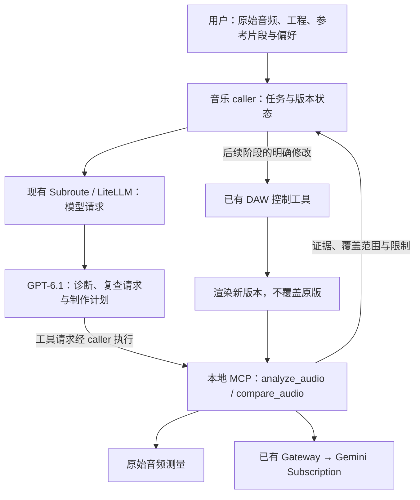

# 音乐听觉 MCP 与混音工作流设计

**日期：2026-09-30。状态：Gemini Subscription 听觉 MVP 已实现并实测；专业混音闭环与下文扩展契约仍待实现、验收。**

用户目标是让 GPT-6.1 配合本地听觉工具，逐步形成能承担中文 Hip Hop / R&B 制作的混音工作流。重点是编曲、旋律、人声、节奏与听感，尤其清晰度、齿音（sibilance）、厚度、气息和空气感。参考艺人由用户指定为超星男孩、歪歪超、Bill Kang (BK)；具体参考歌曲与 BK 身份仍待确认，不能据艺人名字推断实际混音特征。

最初交付范围是设计与文档；用户随后明确要求修好网关，让 MCP 直接走现有 Gemini。现已实现并注册两个只读入口，不新增听觉模型、API key 通路或容器。“两个入口”指一个普通 MCP server 暴露两个工具，不定义名为 MCP2 的新协议。

## 当前可用的 Gemini MVP

`python -m subroute.music_mcp --root <音频目录> --gateway-url http://127.0.0.1:4000` 启动标准 stdio MCP，额外依赖用 `pip install -e ".[music]"` 安装。当前已将 `subroute-music` 注册到本机 Codex，文件根目录是 `D:\github\subroute`，仅允许其内部 WAV/MP3。新会话加载该配置；本次通过真实 MCP SDK 完成握手、发现工具和调用，并未宣称当前会话的动态工具菜单已经刷新。

当前参数比下文专业设计简单：`analyze_audio(asset_path, question, focus)`；`compare_audio(a_path, b_path, question, focus)`。最多两个文件、合计 20 MiB。返回 `gemini-listening-v1` structuredContent：原文件哈希、WAV 时长/采样率/声道、实际 provider usage、Gemini 观察与限制。`complete` 指完成此次订阅请求和指定文件读取，不证明其判断正确。

```json
{"asset_path":"audio/suno-original.wav","question":"听一下主歌和副歌的人声清晰度、齿音、旋律与编曲，指出需要复查的时间段。","focus":["人声","sibilance","编曲","旋律","groove"]}
```

MCP → 本地 gateway Chat `input_audio` → 原有 Antigravity Subscription → `view_file` 真音频输入 → 观察结果 → GPT。明确音频输入覆盖保存的 Force/alias/off/auto 路由，固定 Gemini 并关闭本请求 Advisor；保存策略不被修改。Messages/Responses 音频明确拒绝，不能静默转成文字。音频会发送到 Google，属于订阅云推理。这里取代最初设计的本地音乐模型选型；其他模型的研究只作历史备选，不是本轮执行路线。

当前没有 DSP 测量、响度匹配、stem 处理、区域裁剪、taste profile、revision manifest 校验或 DAW 修改。下文这些字段和验收仍是后续专业设计，不能按已经实现使用。实际错误包括上游过滤拒绝、时长/BPM 估计错误、将双单声道猜成立体声铺展。看 [实测与根因记录](../evals/gemini-audio-2026-09-30.md)。

## 产品目标与当前边界

预期价值是让 GPT 主动检查声音、复查局部和比较版本，提出有证据的制作建议，并在后续执行阶段发现退化、保留版本、回退和交付。最危险的假设是：音乐描述模型对清晰度、齿音和处理损失的判断能可靠支持专业混音。该假设必须通过目标赛道的盲听验证。

GPT-6.1 Sol 官方接口不支持原生音频输入。工具返回的是测量、听觉模型观察、图表和限制，不能把它们称为 GPT 直接听见原始波形。MCP 返回 audio 内容也不自动改变主模型的输入能力。

当前 `config/litellm.experts.yaml` 声明 Advisor 的 text/vision 能力。GPT 通过 MCP 收取 Gemini 的听觉观察；实际音频进入现有 Gemini Subscription，初始文字通路限制已用受限文件读取适配解决。原始失败仍保留在实测记录中。

## 职责与集成



| 所有者 | 职责 | 避免的失败机制 |
| --- | --- | --- |
| Subroute / LiteLLM | 现有模型协议、部署、路由、usage、超时和既有 Advisor orchestration | 重复实现公开协议或建立竞争的路由策略 |
| 音乐 caller | 请求 GPT、执行其工具调用、关联工程与音频版本、记录偏好和停止条件 | 将工具调用误认成网关已执行的动作 |
| 听觉 MCP | 当前：文件限制、哈希、原始字节提交 Gemini、观察与 usage；后续：DSP 测量 | 音频被转成文字后仍声称已经听过 |
| 已有 DAW / DSP 工具 | 读取工程、明确参数修改、读回、渲染、恢复版本 | 参数写入成功却没有验证实际声音 |
| 用户与盲听评审 | 定义审美、确认实际改善、接受交付 | 用模型自己的好评分替代听感验收 |

当前使用已安装的标准 MCP SDK 1.28.1，由可选 music extra 固定；一个本地 stdio 进程复用既有网关和订阅，不新增协议网关、数据库、队列服务或模型注册框架。现有 Gateway、PostgreSQL、staging 和 Compose 角色保持原职责。DAW 接口和下文专业契约仍属后续增量。

当前 MCP 的用途是让 caller 提交原始音频并获得现有 Gemini 的听觉观察；维护负担是 SDK 固定版本、音频边界和失败回收。下面保留专业阶段的测量与处理设计；没有为这些未来能力引入依赖、权重或 GPU 任务。

MCP 进程负责解析自己的允许目录和资源上限；caller 负责音乐任务预算；Gateway 负责自己的模型路由策略。MCP 显式 backend 选择不得被全局 `force`/`auto` 改成不支持音频的 provider。新增音乐模型路由前先检查部署版本的 LiteLLM 能力，存在具体缺口才讨论窄适配器。本设计不创建音频 HTTP endpoint 或新 fallback 链。

## 两个入口的专业阶段合同（待实现）

以下是后续专业阶段的预期合同，不是当前 Gemini MVP 的参数或行为。两者都属于只读听觉工具。可以写任务报告和试听副本，不能覆盖输入、改 DAW、加载处理链或自动购买/调用云端服务。该阶段先支持允许目录下的本地 WAV，mono/stereo；其他格式明确拒绝，后续以实际需要增量支持。当前 MVP 的 WAV/MP3 支持与已授权 Google 订阅调用见上文。

`asset_path` 是相对 caller 绑定的音频工作目录的路径。解析后验证真实路径及链接目标仍在允许目录；禁止 URL、路径穿越和目录外引用。读取输入并建立不可变快照，计算 SHA-256，后续解码和缓存都使用该快照。报告使用逻辑文件名，不向云端暴露绝对路径。

| 入口 | 必填输入 | 可选输入与默认值 | 结果 |
| --- | --- | --- | --- |
| `analyze_audio` | `asset_path`、非空 `focus` | `range_seconds` 默认全曲；`question` 默认无；`stem_paths` 默认空；`taste_profile_path` 默认无 | 原始测量、局部观察、疑似原因、建议验证动作、未评估项 |
| `compare_audio` | `a_path`、`b_path`、`comparison_type`、非空 `focus`；revision 时还需 `revision_manifest_path` | `a_range_seconds` / `b_range_seconds` 默认各自全曲；`question` 默认无；`taste_profile_path` 默认无 | 分维度差异、响度匹配信息、损失与改善、有限推荐和未评估项 |

`focus` 只接受 `vocal_clarity`、`sibilance`、`artifacts`、`dynamics`、`stereo`、`groove`、`arrangement`、`melody`。未知项拒绝，不静默忽略。时间区间为 `[start, end]` 秒，要求有限数、`0 <= start < end <= duration`；不自动截短。所有偏好文件、revision manifest 和 stems 使用相同允许目录检查。

### analyze_audio

```json
{
  "asset_path": "audio/suno-original.wav",
  "range_seconds": [45, 75],
  "focus": ["vocal_clarity", "sibilance", "artifacts"],
  "question": "定位刺耳位置，区分人声齿音、镲片和生成伪影。",
  "stem_paths": {"lead_vocal": "audio/lead-vocal.wav"}
}
```

先解码原始音频并核对实际采样率、声道、时长和样本是否有效，再做必要测量和有限音乐推理。频谱异常是线索，不自动等于刺耳；高频多也不自动等于齿音。模型报告位置只能作为待复查区间，不能假定精确到字或毫秒。

报告需区分原始单轨、已处理 stems、分离 stems、混音成品和来源未知。用户声明的来源不能冒充已验证来源；分离伪影不能自动归因于原混音。stems 必须核对时长与时间起点；不具备可验证对齐关系时标为辅助材料。判断“放回伴奏后如何”必须有混音上下文。

### compare_audio

```json
{
  "a_path": "audio/original.wav",
  "b_path": "audio/deessed-candidate.wav",
  "comparison_type": "revision",
  "revision_manifest_path": "versions/deessed-candidate.json",
  "a_range_seconds": [45, 75],
  "b_range_seconds": [45, 75],
  "focus": ["sibilance", "vocal_clarity", "dynamics"],
  "question": "齿音是否改善，同时检查字头、气息与人声厚度是否损失。"
}
```

`comparison_type` 为 `revision` 或 `reference`。前者要求同一素材和可验证的时间对齐，无法核实则拒绝 revision 比较；允许改用显式 reference 比较，但不自动转换。不同歌曲的 reference 比较不能使用逐样本距离证明混音优劣或旋律相同，内容、音色和编曲差异必须保留。

revision manifest 由 caller 随渲染生成，记录共同源素材 hash、A/B 文件 hash、工程版本、时间起点和延迟补偿。工具核对输入 hash、相等区间长度和解码样本对齐，记录 manifest 来源；manifest 不是听感改善证明，用户手写声明也不能冒充已验证的 DAW 导出记录。缺少来源或存在无法解释的对齐冲突时返回 `alignment_unverified`。

原始峰值、响度和动态分别在未匹配输入上测量。试听副本按选定区间的 integrated LUFS 做增益匹配，并给两者施加相同额外衰减以留出峰值余量；不靠 limiter 匹配，不覆盖原文件。返回方法、增益和残余响度差。静音、过短或测量无效时返回 `loudness_match_unavailable`，不能继续给出整体听感胜负。

听觉判断隐藏原版/处理版、参数、文件名和已有好评，只给 A/B 音频与中性问题；交换顺序复查关键推荐。不同模型使用相同受限前端时不能声称获得独立全频验证。推荐为 `prefer_a`、`prefer_b`、`tie` 或 `undetermined`，必须限定到已评估维度，不能用相似度或平均分掩盖齿音、清晰度、伪影的退化。

## 返回证据与错误

建议返回一个版本化 `structuredContent` 对象，外加简短文字摘要。调用方不需要把长报告全量塞进 GPT 上下文；报告和图表保留在任务目录，后续可按片段再次调用这两个工具。

| 字段 | 合同 |
| --- | --- |
| `schema_version`、`analysis_id`、`status` | 固定合同版本；关联 ID；`complete` / `partial` / `failed`。complete 只表示请求的检查完成，不表示专业质量合格 |
| `inputs` | 快照 hash、逻辑名称、时长、原始采样率/声道、来源声明与是否核实 |
| `coverage` | 每项检查的实际时间范围、原始/派生音频、前端采样率/声道、模型与处理版本；遗漏区间明确列出 |
| `measurements` | 名称、数值、单位、区间、算法版本；无法测量则 unavailable，不能填零或估计成 provider 数据 |
| `findings` | 维度、区间、观察、假设、证据引用、验证动作；区分 measured、model_observation 和 user_preference |
| `comparison` | revision/reference、对齐证据、响度匹配、分维度改善/损失、有限推荐；仅 compare 返回 |
| `limitations`、`unassessed` | 缺少 stems、频段缺失、时间覆盖不足、判断冲突、尚无可靠检测器等 |
| `execution` | 后端实际调用、耗时、重试次数、取消/终止状态；本地 usage 不可得时标未知，不能捏造 token 或 GPU 峰值 |
| `artifacts` | 任务目录内报告、图表、试听副本及 hash；图表只是辅助证据，不能证明好听 |

后端不可用但原始测量完成时返回 `partial`，缺失的音乐判断写入 unassessed。关键判断缺证据则 `undetermined`。不把模型自报置信度当作校准概率，不把测量与模型意见简单平均。

稳定错误类别：`invalid_input`、`unsupported_format`、`asset_not_allowed`、`decode_failed`、`alignment_unverified`、`loudness_match_unavailable`、`backend_unavailable`、`resource_limit`、`timeout`、`cancelled`。MCP 工具失败带 `isError: true` 与结构化错误原因。失败的工具不会产生假的成功 findings；取消后清理完成才释放计算槽位。

## 原始音频、后端与预算

原始采样率和立体声保留用于测量与试听；仅音乐后端需要的副本重采样或转 mono，必须记录。Music Flamingo 与 Qwen2.5-Omni-7B 配置均使用 16 kHz 前端，无法保留 8 kHz 以上原始内容。这些模型可参与音乐理解，不承担完整空气感、高频细节或立体声验收。原始频谱测量也不能替代高频听感。

| 候选 | 可研究用途 | 当前限制 |
| --- | --- | --- |
| Music Flamingo | 结构、编曲、旋律、音色与片段问答 | 非商业研究权重；16 kHz 前端；本机量化运行和中文赛道质量未验证 |
| Qwen2.5-Omni-7B | 中文问答与人声相关观察的对照 | 16 kHz 前端；中文转写不证明混音诊断可靠 |
| LLM2Fx-Tools / Diff2Mix | 后续效果链建议和多轨候选混音研究 | 不纳入首轮依赖；许可证、硬件、工程映射与目标赛道质量仍需分别核验 |

上表是最初本地选型研究，已被本轮明确的 Gemini Subscription 选择取代。没有部署这些候选模型。后续若加入必要的 DSP 测量，要和主观听觉观察分开。

首轮实现建议上限为每文件 512 MiB、10 分钟、1 个 GPU 任务；最多排队 2 项、等待 2 秒；每工具总 deadline 180 秒、无自动重试。compare 的两个输入和必要 A/B 顺序复查共用该 deadline。这些是设计默认值，不是当前运行配置；以本机实测调整，调整后更新此合同。超限拒绝，不静默截歌。模型只能处理部分窗口时必须返回真实 coverage，并保持相关全曲判断 unassessed。

caller 为一次混音决策设置总调用预算，不能通过反复局部调用绕过任务上限。取消传播到解码和推理；不能可靠中断的 worker 必须在释放槽位前终止并回收。缓存按输入 hash、后端/前端版本、区间、问题、focus、偏好 hash 及比较配置命中，不按文件名复用。音频缓存有大小上限，清理只作用于工具自建副本。

原先本地处理、不上传音频的方向已被用户要求的 Gemini 订阅路径取代。当前原始音频会发送到 Google；网关不下载权重或添加文字 fallback。Production/staging 仍共享现有订阅凭据和 CLI 历史，不能声称听觉任务完全隔离。

## 混音执行与品味

两个入口不能修改音乐。后续沿用已验证的 DAW 控制工具读取实际工程，输出有限修改，参数读回后渲染候选，再用 compare 验证。每次候选记录工程版本、效果链、参数、自动化、渲染区间和源 hash；保留原工程与音频，失败回退。控制接口不暴露的插件参数必须明确未执行，不能用“已发送命令”当作混音完成证据。

第一轮专业切片覆盖全曲人声电平、局部遮蔽、齿音与动态、空间，以及鼓/808 配合。编曲、旋律、表演和生成伪影需保留重做素材的建议，不能假设 EQ 能修好。原始分轨优先；已经混好的成品只能承担与素材可恢复程度相符的修复、再平衡或母带任务。

品味从用户确认的具体参考片段与 A/B 选择建立。偏好文件由用户/caller 维护，听觉工具只读；未经用户选择不能自动将模型的推荐写成偏好。相似度只作检索线索，不作音乐质量分。清晰度、齿音、伪影与音乐吸引力分别验收；交付响度按用途约定，不统一套用一个 LUFS 值。

## 实现顺序与验收

以下均为后续未完成工作，不因文档完成而勾选：

1. **只读听觉 MVP。** 注册两个 MCP 工具、读取真实 WAV、完成原始测量和一个本地音乐后端调用；GPT 可要求局部复查。保存真实输入 hash、模型调用及实际覆盖。用同名替换文件、静音、目录外引用、超长歌、无后端、超时和取消验证失败与恢复。
2. **可信 A/B。** 同一中文人声段落制作齿音增强、过度压齿音、伴奏遮蔽和原版，隐藏名称和制作参数，交换 A/B 顺序。验证定位、改善/损失、无变化的重复输入及对齐拒绝。保存原始与匹配副本，不能只验证 tool schema 或 HTTP 200。
3. **可恢复执行。** 在独立测试工程里读回状态、有限修改、精确区间渲染、比较、回退；核对全曲电平与关键段落，确认原版 hash 和工程仍可恢复。两入口保持只读，复用 DAW 现有动作接口。
4. **专业实听验收。** 使用未参与调试的中文 Hip Hop/R&B 歌曲与原始分轨，对照原版、固定处理链及专业混音版本做响度匹配盲听。记录用户/混音师选择率、齿音与伪影漏检、处理退化、单曲耗时、实际模型调用/成本与返工。门槛须在看结果前约定；缺少可验证的专业对照时不能宣称达到专业水平。

## 最初设计阶段的文档 QA 与 Skill learning（历史）

本次验收：两个入口可读且输入输出与失败规则完整；从 README、产品方向和架构可找到；设计与当前运行能力分开；旧可靠性目标不被改写。核对 Markdown 本地链接、JSON 示例、diff whitespace 和范围，另做一次单作者内容复查。此处不提供运行、GPU、音质或独立评审通过证据。纯 Markdown 设计不涉及产品 UI，视觉验收不适用。

检查过程保留：首次检查临时强制 `core.autocrlf=false`，导致已有 CRLF 被当作全文件 whitespace 差异，检查失败；第二次把新文件 `git diff --no-index --check` 的差异返回码 1 当作错误，检查再次误报。恢复仓库换行语义并区分差异返回码与实际 whitespace 输出后检查通过，不改写整篇文件。内容复查补齐 revision 的来源 manifest 要求，避免凭相同时间区间就宣称同素材对齐。

最终静态结果：2 个 JSON 请求示例解析成功，3 个本文本地依据链接和 3 个文档入口存在；4 个文档无重复二级标题或 em dash；tracked diff 和新文档 whitespace 检查通过。`GOAL.md`、源码、配置、Compose 与依赖文件无改动。复查由同一作者完成，没有独立评审。本文档范围 READY，工具运行能力及专业混音验收 UNVERIFIED。

**Skill learning：** Northstar 本次用于文档设计交付，技能 revision 未记录。期望交付可实施的两入口合同；实际交付与静态检查结果以仓库 diff 和最终交付说明为准。复用已有文档入口，保留 caller/Gateway/DAW 所有权，避免把音频证据工具扩大成第二个混音执行器。后续用真实 A/B 证据验证这些边界；尚未验证专业听感。未修改安装的技能或用户记忆。

这条“设计完成与运行验收分开，分析工具与执行工具分开”的经验可作为 [Northstar Issues](https://github.com/stancsz/northstar/issues) 的技能反馈；本次仅记录，没有发布外部消息。

## 研究与源码依据

- [GPT-6.1 Sol 输入与工具能力](https://developers.openai.com/api/docs/models/gpt-6.1-sol)、[本地 MCP 接入](https://learn.chatgpt.com/docs/extend/mcp?surface=cli)。
- [Music Flamingo 模型与许可](https://huggingface.co/nvidia/music-flamingo-2601-hf)、[前端配置](https://huggingface.co/nvidia/music-flamingo-2601-hf/blob/main/processor_config.json)。
- [Qwen2.5-Omni 官方仓库](https://github.com/QwenLM/Qwen2.5-Omni)、[前端配置](https://huggingface.co/Qwen/Qwen2.5-Omni-7B/blob/main/preprocessor_config.json)。
- [LLM2Fx-Tools 研究及单乐器局限](https://arxiv.org/html/2512.01559v2)、[Diff2Mix 研究与有限专业听评](https://arxiv.org/html/2608.05442v1)。它们是候选技术依据，不是本项目生产能力证据。
- 当前仓库：[专家配置](../../config/litellm.experts.yaml)、[Antigravity 内容边界](../../src/subroute/handlers/antigravity.py)、[已验证的 Advisor 图片增量及限制](../evals/advisor-image-input-2026-09-30.md)。
